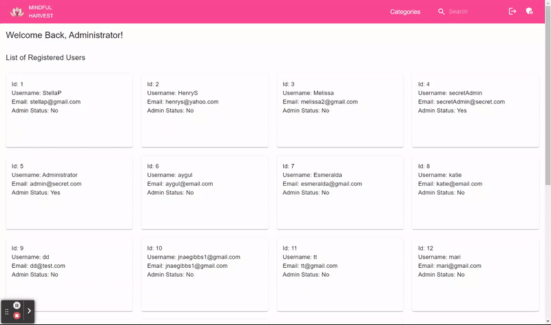
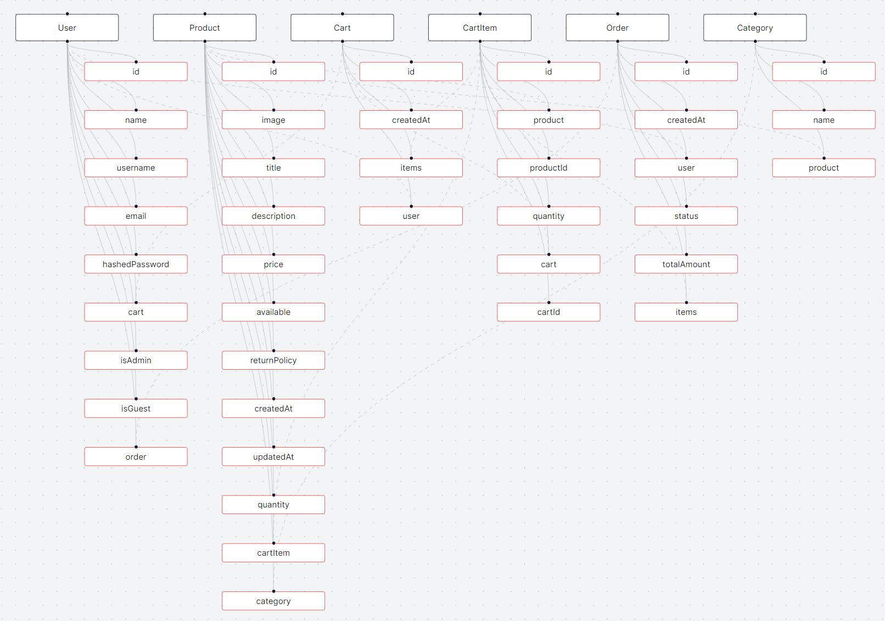

# Mindful Harvest Store
Shopper View
 
Admin View


## Live: https://mindful-harvest.onrender.com/

## Mindful Harvest Web-Store

At Mindful Harvest, we belive in a world built slowly, with care, and compassion. The world we build around us should reflect who we are and how we live.
To create a more connected community that cares about one another, we provide the customer with home-made and organic products like clothing, jewelry, toys, home living, and art, including customisable products. We bring small businesses together and connect customers to local and sustainable products.
At our website, customers can make purchases and have them delivered to their home address. Customers can also make a profile so that the checkout process is easier, as their cart information will be saved for later use.

## Key Featues

Register and Login: Register and log in to your account to access saved information on your account. You will be able to continue shopping with your previously saved cart and access your order history once you create an account. 

Products: Enjoy browsing the many products we have on our website. These products are sustainably sourced and mostly handmade. You can view each product with its image, description and price. You can determine the quantity of the product you'd like to purchase and add to your cart.

Search: If you have a specific item in mind, use our search bar to look up if the item you desire is listed on our website. 

Shopping Cart: Whether you're a logged in user or a guest user, shop with ease as your shopping cart will be saved even after you leave the website and come back to it.

Checkout: When you're ready, view the total price of your cart, adjust the quantity of items if needed, and complete your purchase.

Administrator: As an administrator, you will have access to viewing all of the users of the website, as well as adding, editing, and deleting products. If you would like to log in as an administrator, please use the username 'admin@secret.com' and the password 'admin.'

## Database Model



## Getting Started

1. Make a new repository using this template
2. Add your teammates as collaborators on the repository
3. Clone your repository locally
4. Run `npm install` to install all the dependencies
5. Make a database locally
6. Setup your `.env` file locally. In particular, you will need to setup 'JWT', `PORT` and `DATABASE_URL` environment variables
7. Run `npx prisma migrate`
8. Run `npm run dev` to run locally


### Starting the App

```
npm run dev
```

### Running Tests

This will run Jest with verbose output enabled:
```
npm run test
```

If you want Jest to continually run as files are changed, you can call:
```
npm run test -- --watch
```

Or if you want Jest to continually run all tests when files change:
```
npm run test -- --watchAll
```

### Seed the Database

This will run the `server/db/seed.js` file:
```
npm run seed
```

### Deploying the App

You will need to create a Database in your hosting provider of choice (Render or Heroku both work well, but only Render is free).

Once you have a Database URL setup, you will need to setup your Environment Variables to include your Database URL, as well as any other app secrets needed (eg. JWT secret)

Whichever provider you use, you will need to set the following settings:

**Build Command:** `npm install && npm run seed && npm run build`
**Start Command:** `npm start`

## Basic File Structure
```
.
├── client/
├── dist (ignored by git)
├── mocks/
├── node_modules (ignored by git)
├── server/
├── .gitignore
├── babel.config.js
├── index.html
├── jest.config.js
├── package-lock.json
├── package.json
├── README.md
└── vite.config.js
```

### Client Files

```
.
├── client/
│   ├── components/
│   │   ├── __tests__/
│   │   │   └── app.test.js
│   │   │   └── users.test.js
│   │   ├── AdminAccount/
│   │   │   └── AllProducts.jsx
│   │   │   └── CreateProduct.jsx
│   │   │   └── EditProduct.jsx
│   │   │   └── ProductForm.jsx
│   │   │   └── Users.jsx
│   │   ├── API/
│   │   │   └── adminBoolean.js
│   │   │   └── cartSlice.js
│   │   │   └── categoryIdSlice.js
│   │   │   └── mindfulHarvestApi.js
│   │   │   └── searchFieldSlice.js
│   │   │   └── store.js
│   │   │   └── tokenSlice.js
│   │   ├── Cart/
│   │   │   └── Cart.jsx
│   │   │   └── CartItem.jsx
│   │   │   └── ConfirmationPage.jsx
│   │   │   └──  GuestCartItem.jsx
│   │   ├── CSS/
│   │   │   └── adminpage.css
│   │   │   └── categoriesMenu.js
│   │   │   └── homepage.css
│   │   │   └── loginpage.css
│   │   │   └── Logo-Mindful-Harvest.png
│   │   │   └── registerpage.css
│   │   ├── UserAccount/
│   │   │   └── AccountPage.jsx
│   │   │   └── OrderItem.jsx
│   │   ├── HomePage.jsx
│   │   ├── LoginPage.jsx
│   │   ├── Navigation.jsx
│   │   ├── Register.jsx
│   │   └── SingleProduct.jsx
│   ├── App.jsx
│   ├── index.css
│   └── main.jsx
```

### Server Files

```
.
├── server/
│   ├── __tests__/
│   │   └── cart.test.js
│   │   └── cartItem.test.js
│   │   └── products.test.js
│   │   └── users.test.js
│   ├── api/
│   │   └── cart.js
│   │   └── cartItem.js
│   │   └── index.js
│   │   └── oder.js
│   │   └── products.js
│   │   └── users.js
│   │   └── utils.js
│   ├── db/
│   │   ├── prisma/
│   │   │   └── migrations/
│   │   │   │   └── 20231108025058_init/
│   │   │   │   │   └── migration.sql
│   │   │   │   └── 20231130051054_mindful_app_order_update
│   │   │   │   │   └── migration.sql
│   │   │   │   └── 20231203214414_orderitems_update
│   │   │   │   │   └── migration.sql
│   │   │   └── schema.prisma
│   │   ├── product_images/
│   ├── app.js (configure the app)
│   └── index.js (start the app)
```
